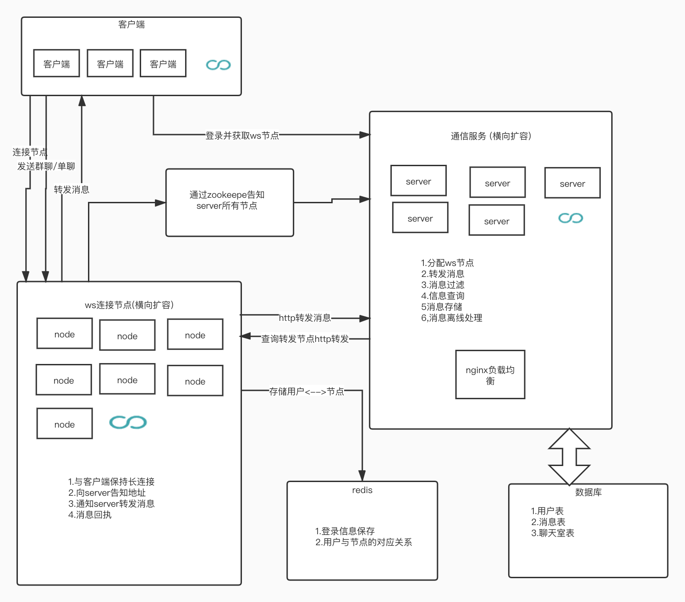

# convoy
## 基于kotlin和netty的IM 聊天服务器

### 服务端使用的技术栈 

* gradle 类似与maven的编译平台 
* kotlin jvm语言 
* spring boot 2.x web开发框架 
* netty 流行的socket框架 
* zookeeper 服务注册与发现 
* redis key-value存储服务 
* mysql 数据库 
* google protobuf 二进制协议 

### 服务端流程图

### 流程介绍

node目录 webSocket服务器节点 
server目录 web服务节点 

node服务通过zookeeper向server服务注册,客户端向server发起登录,server对
客户端分配具体的node连接ip,客户端通过此ip与node服务进行socket连接. 

客户端接收消息和发送消息都直接与node服务进行交互,
node服务接收到客户端的转发消息后,会通过http向server发起转发请求,server用转发的信息
找到对应的聊天室(单聊群聊均为聊天室),通过聊天室找到除发送者外所有的用户对应的node节点,
通过http让这些节点转发给自己对应的客户端,就这样实现单聊和群聊的功能. 

其中node负责保持长连接,转发消息,向redis存储登录信息,状态和用户与node的对应关系,不负责具体的聊天业务,
功能相对独立,便于横向扩容. 

server主要负责查询对应的node,对消息进行一系列的处理,然后通知node进行转发,node服务器也是无状态的,所有对server的
请求都是通过http访问的,这样的话可以用nginx进行负载均衡,便于横向扩容. 

